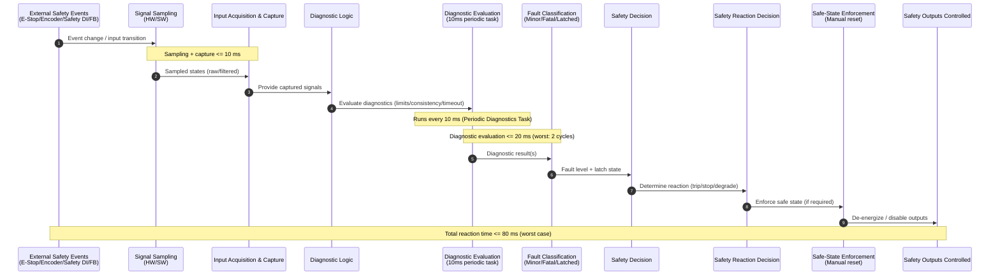

```mermaid
sequenceDiagram
    autonumber
    participant EXT as External Safety Events<br/>(E-Stop/Encoder/Safety DI/FB)
    participant SAMP as Signal Sampling<br/>(HW/SW)
    participant CAP as Input Acquisition & Capture
    participant DLOG as Diagnostic Logic
    participant DEVA as Diagnostic Evaluation<br/>(10ms periodic task)
    participant FCLS as Fault Classification<br/>(Minor/Fatal/Latched)
    participant SDEC as Safety Decision
    participant REAC as Safety Reaction Decision
    participant ENF as Safe-State Enforcement<br/>(Manual reset)
    participant OUT as Safety Outputs Controlled

    EXT->>SAMP: Event change / input transition
    Note over SAMP,CAP: Sampling + capture <= 10 ms
    SAMP->>CAP: Sampled states (raw/filtered)

    CAP->>DLOG: Provide captured signals
    DLOG->>DEVA: Evaluate diagnostics (limits/consistency/timeout)
    Note over DEVA: Runs every 10 ms (Periodic Diagnostics Task)

    Note over DEVA,FCLS: Diagnostic evaluation <= 20 ms (worst: 2 cycles)
    DEVA->>FCLS: Diagnostic result(s)

    FCLS->>SDEC: Fault level + latch state
    SDEC->>REAC: Determine reaction (trip/stop/degrade)
    REAC->>ENF: Enforce safe state (if required)
    ENF->>OUT: De-energize / disable outputs

    Note over EXT,OUT: Total reaction time <= 80 ms (worst case)

```