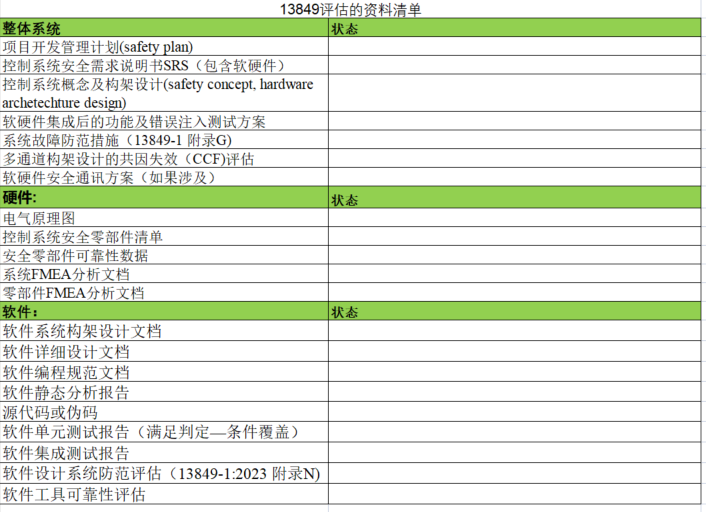
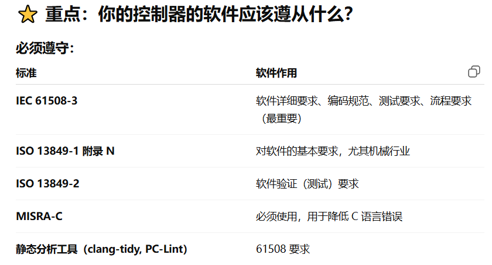
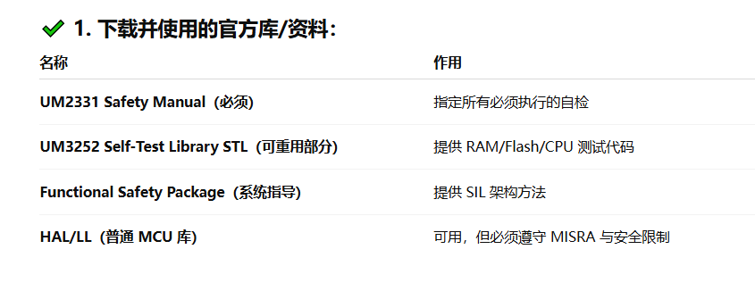

## 阅读
### 1 专有名词
#### 1.1 概括性名词
##### (1) AGV - Automated Guided Vehicle（自动导引车）
- 
##### (2) AMR -Autonomous Mobile Robot（自主移动机器人）

#### 1.1 硬件(1)
- MOSFET继电器：光控制继电器
- SELV（安全特低电压）――更严格，更安全
- PELV（保护性特低电压）――比 SELV 宽松，允许接地
- IP54 = 防尘等级 5 + 防水等级 4
- QEP 增量式编码器接口
- PI：脉冲输入（测速、编码器、频率测量）
- DI：普通数字输入（如急停按钮、限位开关、光电、安全门信号等）
- MOS - MOSFET，金属氧化物半导体场效应晶体管(电子开关器件)
- MOS 就是用来控制电流的电子开关。

### 3. 两种认证体系 - SIL & PL & Category
#### 3.1 SIL(Safety Integrity Level) - 安全完整性等级
##### (1) 基本知识
- 来源标准：IEC 61508/IEC 62061 - 机器安全软件/系统安全
- 本质：系统在要求时成功执行安全功能的概率，侧重电子/电器/可编程系统(E/E/PE)
- 分为四级：SIL1,SIL2,SIL3,SIL4 等级越高，安全要求越高
- 关注点：
  - 安全功能发生危险故障的概率-PFH
  - 软件流程、硬件结构、冗余、诊断覆盖率
  - 开发流程 - V模型开发
  - 故障模式 - FMEDA
- 应用对象：
  - 可编程安全控制器(MCU、FPGA)
  - 安全PLC
  - 软件安全功能
  - 电气-带脑子控制系统
#### 3.2 PL(Performance Level) - 性能等级
##### (1) 基本知识
- 来源标准：ISO 13849-1：2023 - 机器安全-控制系统安全相关部分
- 本质：机械控制系统安全功能的可靠性能等级，常用按钮、继电器、急停回路等
- 分为五级：PLa,PLb,PLc,PLd,PLe - e最高性能等级，常用于AGV/AMR的急停、保护区域监控、动力切断
- 关注点：
  - 架构类别:Gategory1~4
  - MTIFd(平均危险故障时间)
  - DC 诊断覆盖率
  - CCF：共因失效
- 适用对象：
  - 机械安全动作 - 急停、门锁
  - 双回路接触器
  - 机械运动危险区域保护
#### 3.3 Category - 安全硬件架构的结构类型
##### (1) 基本知识
- 用来指导如何设计双通道、、诊断能力、故障容错等
- 分类：B，1，2，3，4
  - B：基础结构 - 可达最高的PLa或PLb
  - 1：高可靠元件
  - 2：周期检测
  - 3：双通道冗余 + 故障检测
  - 4：双通道 + 高诊断 + 不允许未检测故障
### 4.V型研发流程

####  4.1 61508-3的软件安全生命周期

# 软件开发
## 0 记录
### 基本的
- 安全功能必须在控制器内部闭环验证，不能依赖外部通信网络，否则安全等级无法保证
- 
## 1. 硬件方面的了解
### 1.1 接口统计
- 24V电压
- GPIO 14+4+7+4+4+3+
  - 输入
    - 14 对隔离型数字输入信号
      - 奇数通道 → MCU1 采集
      - 偶数通道 → MCU2 采集
  - 输出
    - 4对功率输出口
      - MCU1控制奇数功率输出
      - MCU2控制偶数功率输出
    - 7个雷达输出控制，MCU1/MCU2各7个
    - 4个急停控制引脚
    - 4路高边开关
  - 反馈：
    - MCU1_PF         :PF信号反馈
    - MCU1_WD         ：看门狗反馈
    - MCU1_RST        ：交叉复位
    - PO1_FB...PO2    ：输出反馈DO_FB
- ADC
  - 6路编码器信号 - 三个电机（冗余双编码器）
- MCU冗余链路
  - SPI：高速，主通信，实时，异常进入安全模式
  - UART：低速，备用通信，检测SPI是否失效
- 通信 CAN/RS485
  - CAN：逻辑Core通信接口，支持PDO配置同步或异步
  - RS485：日志及调试 -> 记录目前待定的pc端或工控机

### 1.2 硬件接口
- MCU间的冗余通信：SPI和UART
- CAN/RS485数据传输
## 2. 安全要求

### 2.1 IEC 61508-3 - SIL3软件核心标准
#### 2.1.1 软件生命周期模型（V 模型）
#### 2.1.2  软件需求规格（SRS）
#### 2.1.3 软件架构设计要求
#### 2.1.4 软件详细设计要求
#### 2.1.5 软件编码规则（Coding Guidelines）
#### 2.1.6 静态分析要求
#### 2.1.7 单元测试（MC/DC, C1, C2 覆盖率）
#### 2.1.8 软件验证和确认
#### 2.1.9 工具链验证（compiler, static analyzer）
#### 2.1.10  防止系统性故障的措施
#### 2.1.11  异常处理、错误检测机制
#### 2.1.12  冗余计算、交叉监控要求
#### 2.1.13  软件文档化要求
### 2.2 安全通信协议的要求 - EN 61784-3:2016
#### (1) 确定是安全通道
- 冗余CPU内部通信
  - 封闭链路
  - 数据必须被双MCU交叉验证
  - 须实现以下机制
    - CRC保护 - ≥16 bit
    - 消息计数器
    - Alive/Timeout监控
    - 互相监控 (Cross-monitoring)
    - 错误检测 - 安全状态
#### (2) 非安全通道
- CANopen、普通 CAN2.0、RS485、Modbus 都不是“安全协议”。
- 它们不符合 EN 61784-3 的要求，所以不能传输安全相关数据。
#### (3) 安全通道
- 数字输入DI，急停，限位
- 模拟输入 -编码器
- 电源输出高边开关
- inter MCUs 通信链路 - SPI，CRC，校验
### 1.0 基本知识
- 功能层（MCU1） + 安全层（MCU2）双通道架构
- 安全标准：EN ISO13849
  - 安全等级：B，1，2，3，4
  - 2：有诊断，不冗余
  - 3：冗余+诊断
  - 4：最高级别，适合SIL3/PL e
    - 双通道完全冗余 + 互监控（cross-monitoring）
    - 任何单一故障不会导致危险
    - 累积故障也能检测（如 RAM/Flash ECC、自检、CRC）
    - 要求极高诊断覆盖率 DC（>99%）
### 1.1 核心、重要
#### 1.1.1 SIL软件开发-三大核心原则
##### (1)开发过程必须可追踪 (Traceability)
##### (2)每阶段须有对应的验证步骤 (V模型左右对齐)
##### (3)故障必须被遇见、检测、控制，不能导致危险输出
### 1.2 V详细步骤
#### 1.2.1 系统需求 - System Requirements Specification

### 1.1 电源系统
- 电源分区 ：MCU1和2互不干扰
### 1.双存储
#### (0) 
#### (1) 不同字节
#### (2) 不同寄存器
#### (3) 两段Flash 
### 2.看门狗
