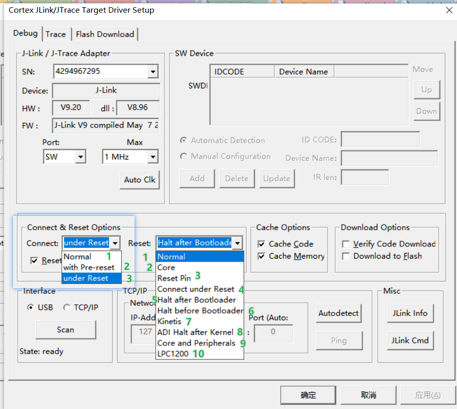
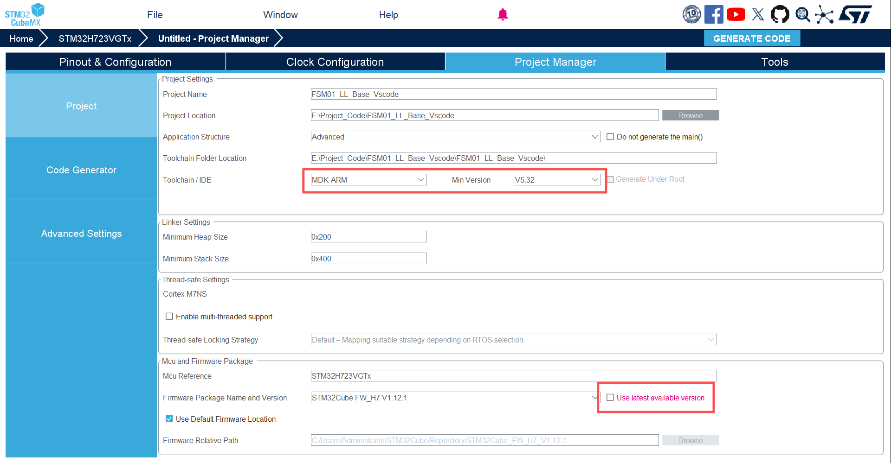
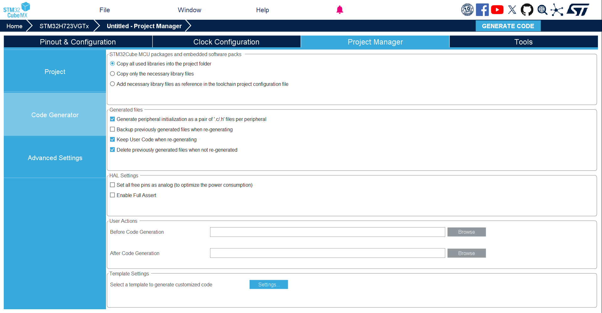
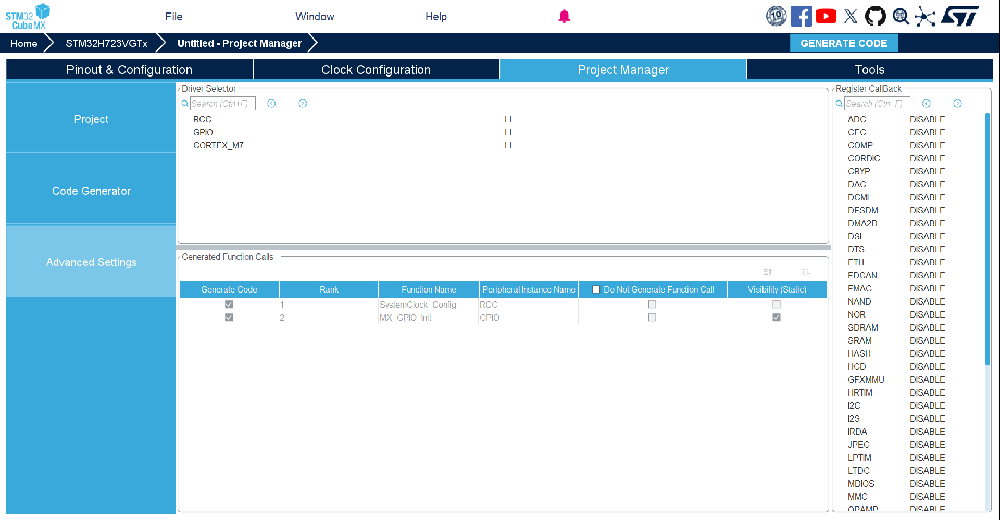
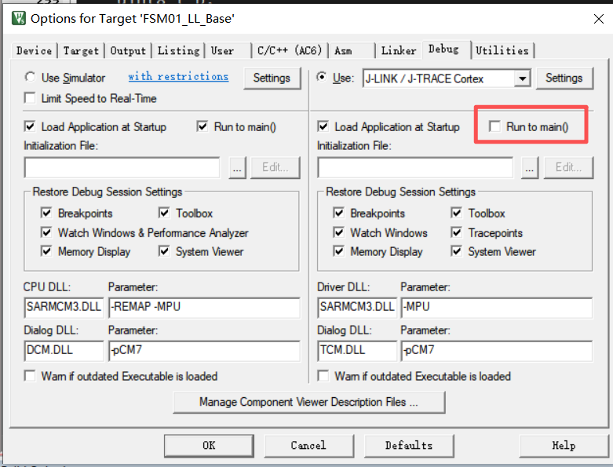
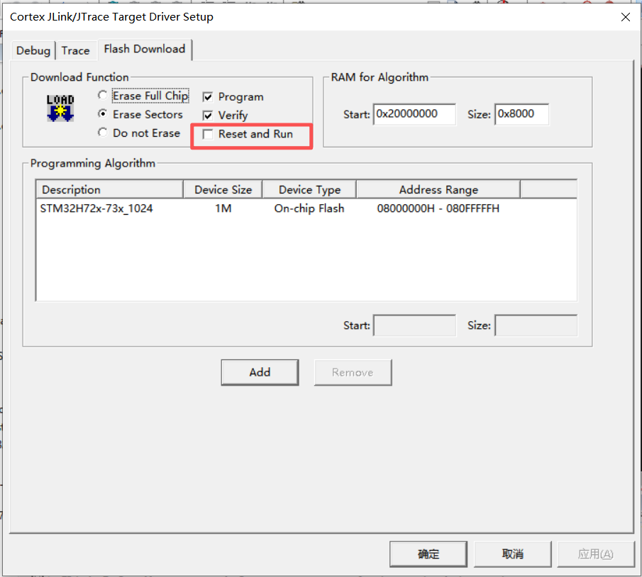
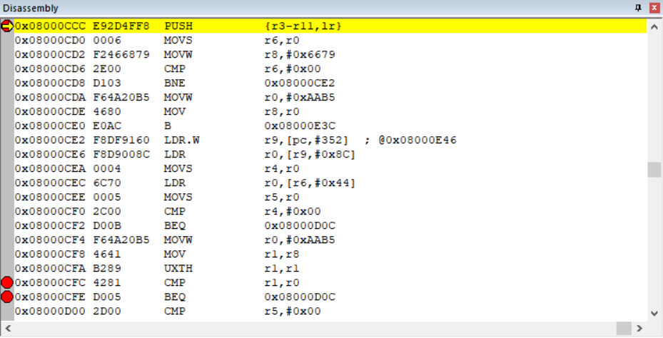

# 基础性问题
## keil软件
### 1.Connect & Reset Options

#### (1) Connect
- normal:不主动复位；如果一上电就死循环，调试器可能来不及
- with Pre-reset:先复位再连 - 连接前触发一次复位
- under Reset（按住复位线连接）：调试器将`NRST`拉低不放
#### (2) Reset 复位策略
1. Normal:默认方式复位 - 根据目标与配置选择
2. Core:只复位内核，通常不依赖NRST - 每次调试都能把 CPU 拉回干净状态
3. Reset Pin:通过NRST引脚硬复位
4. Connect under Reset:住 NRST 连接”的救砖方式
5. Halt after Bootloader / Halt before Bootloader:有 bootloader 阶段”的芯片/方案准备的

综上：配置选择Connect = With Pre-Reset; Reset = Core
SWD速度：从1Mhz降低至100-400会有效降低
Cache Memory：测试阶段关闭这个，不然会看到“缓存假象”
### 2. Options for Target -> Output
#### (1) 设置“编译生成物输出目录”（强烈建议按 Target 分开）
### 3. Target
#### (1) Floating Point Hardware（很关键）
- 推荐选择：Single Precision
原因：STM32H7 的 FPU 是单精度（FPv5-SP），双精度会走软件库/更慢/更难控。
---------------------------------------------------------------------------------------------
# 0 环境配置
## 0.1 Cubemx的设置
### 引脚
#### (1) DEBUG >> Serial Wrie
- 选择`Trace and Debug` >> `DEBUG` >> `Serial Wire`
- (拓展)Debug接口：
  - SWD：双线
  - JTAG：4线
#### (2) RCC >> Master Clock Output 1 (MCO1)
- 目的：用示波器/频率计直接测到 SYSCLK/PLL 输出，作为验证证据
- 占用一个引脚（常见是 PA8）

#### (3) RCC >> Parameter >> HSE Startup Timeout Value (ms)：
- 改成 200ms
#### (4) PWR >> PVD:实时监控MCU主电源的电压
- “Analog voltage detector”（你勾了 ✅）启用电压比较器类监测功
- Power Voltage Detector In = Internal analog voltage”
- PVD detection level（VDD）：建议先从 2.7V 或 2.85V 这一档位开始（而不是 1.95V）
- AVD detection level（VDDA）：如果 VDDA=3.3V 且 ADC/模拟量用于安全判定，建议用 2.8V 档位；
#### (5) Keil >> CSS (程序中修改)（Clock Security System）
- CSS是一个纯粹的硬件安全机制，持续检测HSE是否失效，一旦失效
  - 自动切换为HSI
  - 触发中断：产生一个不可屏蔽的中断
- SystemClock_Config() 末尾强制开 
#### (6) IWDG 配置
- 安全控制器是一条必须可论证的安全诊断链路：
  - 检测程序流失控/卡死/时基异常，并在规定的故障反应时间内把系统拉回到已知安全状态（Safe State / 复位后硬件去能）
  - 不依赖主时钟，由独立的低速RC驱动
#### (7) PWR
- 
### 时钟配置
#### (1) 时钟选择
- SYSCLK=PLLCLK = 400 MHz，HCLKx=SYSCLK/2 = 200 MHz，PCLKx=HCLKx/4 = 100 MHz
- 时钟系统不仅是`性能`，更是`故障检测`、`容错`、`安全状态管理`的关键硬件基础
  - 时钟配置从 `最高性能` 转变为`安全时序、确定性、降额裕量、时钟故障检测与安全反应`。
  - 目标是 SIL3 安全控制器并要留下审计证据：改成 HSE→PLL + 开 CSS + 保留 HSI/CSI 备份 更合适
  - TIM5配置两种时钟一种是中断的1μs的时基 ： 节拍+监督+置旗
  - 
### Project Manager
### (1) 生成

---------------------------------------------------------------------------------------------
# 1 STM32H7问题

---------------------------------------------------------------------------------------------
# 3 STL问题
## 3.1 配置
### (1) 文件
- `.a`文件如何包含进项目：在 Linker 里手动指定库路径和库名（更可控）
  - Options for Target -> Linker -> Misc Controls
  - --userlibpath=".\Integration\ST\STM32_Safety_STL\Lib" --library STL_Lib_product_x1.a
## 3.2 
## 3.3 提前准备
### 3.3.1 寄存器故障注入
### 3.3.2 ISR 故障注入
#### 3.3.2.1 防护
##### (1) 测试固件护栏
1. `编译器开关隔离 `: 
    - SVC_STL_FAULT_INJECT=1 在现在测试故障注入的时候使用
    - 运行时解锁 key（没有 key，任何情况下都不注入）。
2. `oneshot：`:
   - armed(窗口开关)：注入后立刻归零 - 避免重复注入
   - oneshot_done(已注入标志):注入后置1 - 防止复位后又注入（存放noinit，注入后立刻归零）
3. `窗口化：`：默认永不注入 + 只在目标 TM 段允许
2. `危险输出永远关闭：`

##### (2) 调试域恢复通道准备
1. `复位循环继电器`：连续复位多次（通常来自 IWDG/HardFault），就自动进入Safe Boot Mode
2. `"调试器留"可接入窗口"`:启动最早期延时 200–500ms 再开注入/再开高频中断

##### (3) 注入梯度
第 1 阶段（推荐起步）：只改 R0/R1（最容易“TM fail”而不是立刻 HardFault）
第 2 阶段：改 APSR 标志（通过 xPSR 的 N/Z/C/V 位）——仍有风险
第 3 阶段（最后才做）：改 PC/LR（很可能直接 HardFault/跑飞）,必须在调试器已连接才允许，且启用iwdg

#### 3.3.2.2 具体如何做
注入控制块（volatile + oneshot + 窗口 + hit_after）
一个高优先级定时器中断（TIM6/TIM7 最方便）
Naked ISR：用 EXC_RETURN 判断 MSP/PSP，然后把 sp 传给 C 函数
注入动作：修改 stacked frame 的字段

#### 3.3.2.2 ISR故障分类
不是指某一个具体错误，而是一类会导致中断行为偏离设计意图的现象
##### (1) 故障分类
1) 配置与路由类故障（中断不按你想的来）
2) 时序类故障（“能进 ISR”，但时间不对）
3) ISR 内逻辑类故障（ISR 写错了）
4) 并发与共享资源类（数据被“撕裂/踩踏”）
5) 内存/栈/上下文类（最致命，直接 HardFault）
6) Cache/DMA 一致性类（H7/M7 上特别常见）
7) 外界扰动与毛刺类（电气层导致 ISR 误触发）
##### (2) 关系的安全后果
1) 关键 ISR 没来（漏触发/被屏蔽）
2) 关键 ISR 来了但太晚/太频繁（延迟/风暴）
3) ISR 执行了不该执行的动作（逻辑错误/共享数据破坏/误注入）
##### (3) 几类安全主张
1) 自检/诊断机制本身是否可被触发、可被监控：
- 自检确认执行、运行期诊断执行；
- 故障出现 → 诊断识别 → faultlog 记录 → 安全动作 → 复位/保持安全态
2) CPU 执行路径类危险故障的覆盖：对其失效模式给出高诊断覆盖：
 - 控制流异常（跳飞、错误指令序列）
 - 寄存器/ALU 错误（关键寄存器位翻转、计算错误）
 - 中断控制相关故障（中断被异常屏蔽/异常升级、优先级混乱导致关键 ISR 不执行）
 - FPU上下文管理故障（Cortex-M特有）
**STL类注入通常需要覆盖：**
 - “执行完整性”相关的检测（控制流监控、PC 监控、寄存器一致性）
 - “中断路径”相关检测（tick 活性、关键 ISR 活性监测、ISR 超预算/风暴检测）
3) 存储器类（RAM/Flash）危险故障的覆盖
- RAM March 测试（上电/分区轮测）
- Flash CRC/签名校验（上电/周期）
- 关键配置/参数的完整性（CRC+反码/双份比对/序列号）
- ISR 数据正确性（ISR 处理 DMA/共享缓冲必须一致）
4) 时基/调度与 ISR 相关的危险故障覆盖（你问 ISR，就重点在这）
**必须证明：**
- tick 活性检测：1ms tick 丢失/停滞能被检测
- ISR 超预算检测：关键 ISR 被拖长能被检测
- 中断风暴检测：异常频率能被检测并进入安全态
4-1 活性/时序：tick、延迟、超预算、风暴、关键 ISR 频率
4-2 路由/正确性：vector/IRQn、外设 IT 使能、flag 清除、事件不丢不重、
**故障注入应覆盖：**
- ISR 被屏蔽/延迟（模拟“关键 ISR 不来/太晚”）
- ISR 风暴（模拟“flag 不清/异常频繁”）
- ISR 内阻塞（模拟“ISR 执行超预算”）
- 并发一致性破坏（模拟“ISR 与任务态共享数据撕裂”）
5) Fail-safe 行为可靠
- 安全态动作是否执行且不可被绕过
- 复位后是否保持安全（例如 oneshot_done、故障锁存）
- 不会因为风暴/延迟导致安全动作本身来不及执行
- 异常/HardFault/栈类失效的安全失效（复位、锁存、记录）

## 3.4 注入点
#### 3.4.0.1 参数注入（PARAM）
#### 3.4.0.2 配置注入（CONFIG）
- RamConfig（以及未来 FlashConfig）填完后，STL_SCH_ConfigureAllTM() 之前
#### 3.4.0.3 流程注入（FLOW / 返回 KO）
- 强制 Init/InitAll/Configure/Run 返回 KO，验证你对 KO 的处理链。
#### 3.4.0.4 结果注入（RESULT / 强制 FAILED）
- STL_SCH_RunAllTM() 成功返回之后、你开始检查 TM 结果之前。
#### 3.4.0.5 INJ_ARM（危险注入 Arm 点）
位置：STL_SCH_RunAllTM() 前一行
用途：需要持续影响/异步干扰的注入（ISR、时钟扰动开始、硬件故障模式开始）

## 3.5 CPU 自检 & 故障注入
### 3.5.1 前置
#### (1) 分类
- 人工失败：让 STL 指定某个 CPU TM 返回你指定的结果
- 上下文/干扰类注入：故意破坏 STL 执行的前提条件
- 机制级注入：破坏被测对象或其判定逻辑所依赖的对象
#### (2) 具体的注入类型
- 通用寄存器：

### 3.5.2 寄存器的故障注入 - CPU 寄存器（GPR）
#### (1) 目标
- 验证"检测链路"：STL 的“寄存器 TM（Test Module）”能否从 PASSED 变成 FAILED/ERROR
- 验证"反应链路"： 一旦失败，是否按SIL3逻辑：进入 SafeState、锁存、记录证据、禁止自动恢复、必要时复位等。
#### (2) 覆盖哪些故障类型
- stuck-at（某位永远 0 或永远 1）
- bit flip / transient（瞬态翻转）
- coupling/bridging（位间耦合，写 A 位影响 B 位）
- decoder faults（寄存器寻址/译码异常，写错寄存器等）
#### (3) 天然限制
- 它无法证明“100%寄存器无故障”：软件自检只能覆盖其故障模型与执行路径
- 它很怕“中断/上下文干扰”：因为 ISR 可能破坏寄存器内容
    所以 STL 往往要求：
    TM 在 thread mode 下跑
    TM 执行窗口中 中断屏蔽 或要求 ISR 满足严格的“保存/恢复寄存器”的 ABI 规则
#### (4) 分类
- 通用寄存器/PSR 类（Data-path / Register faults）
- 控制流/指令流 类（Control-flow / Instruction faults）
- 栈与上下文 类（Stack/Context faults）
- CPU 内部 RAM/工作区 类（CPU local RAM / TM workspace）
- 算术逻辑/比较 类（ALU/Comparator faults）
- 时钟与时序 类（Clock/Timing faults）
- 异常/中断 类（Exception/Interrupt faults）
- 总线/取指访问 类（Bus/Fetch faults）
### 3.5.3 进行
#### (1) 强制寄存器 TM 失败
- 确定CPU的TM然后修改输出的结果
#### (2) 调试器篡改寄存器（真正触发“检测链路”）
1) 优化最低
2) 关闭上电自启动到main

3) 若是不到main，就按RST重启
4) 反汇编里，找到它内部的 CMP + BNE/BEQ 对比点，在对比前把其中一个操作数轻微破坏（寄存器或内存），让它自己走 fail 分支

- 0x08000CCC是入口
- 0x08000CF0：
- 改CF0时的R4为非0
- ctrl+F11跳转到0x08000CFC
- 下边要强制不相等，输出错误
#### (3) ISR 干扰式寄存器注入（最强也最危险）

## 3.6 RAM自检 & 故障注入
### 3.6.1 前置
#### (1) 
### 3.6.2 进行测试
#### (1) 调试器直接篡改被测 RAM（最简单、最推荐先做）
#### (2) 软件注入（oneshot）
#### (3) DMA 干扰式注入
#### (4) ISR 干扰式注入

### 3.7 Flash自检 & 故障注入

### 3.8 其他自检 & 故障注入
#### 3.8.1 包含点
- 供电与电压检测
- 时钟域时基诊断（关键）
- 看门狗链路
- 通信域链路完整
- I/O输出
- 软件运行时完整性

#  IWDG问题
## 1 前置知识
### (1) 基础问题
- 使用的是`LSI`内部低速时钟≈32kHz
- 为何配置2s，兜底，系统失控能够强制复位
- 为何分频选择最大的`256`：
  - Reload不会太大也不会太小
  - 分频合理：计数频率=32000/256 = 125hz  >> 间隔1/125=8ms
## 2 实际操作
### 2.1 基本流程
- 确定超时时间 - 2s
- 开启 LSI 并等待就绪
- 解锁 IWDG 写权限
- 配置 Prescaler / Reload（可选 Window）
- 等待寄存器同步完成（SR 清零）
- 喂一次狗
- 启动 IWDG
- 主循环/安全调度器里单点喂狗
### 2.2 详细步骤
#### (1) 计算时间
**公式**：T ≈ ((Reload + 1) × Prescaler) / LSI
$$
T \approx \frac{(Reload + 1)\times Prescaler}{LSI}
$$
T = 2s ; 
Prescaler = 256; 
Reload =32000*2/256 -1 = 249

# ISR 故障注入操作
## 1. 诊断机制验证 - 验证注入故障，能够被触发
