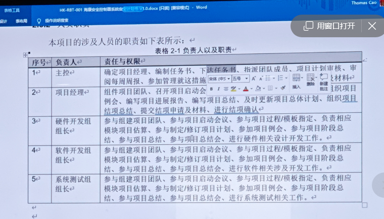
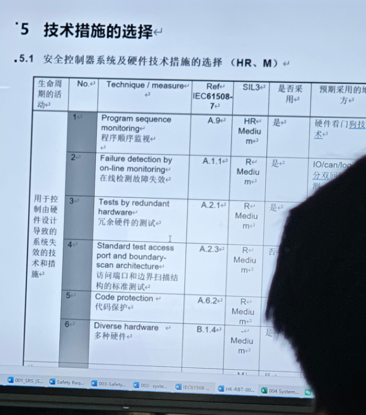

# 1-29 指导专家的第一次指导
## 1. 和杭哥的交流
1） 确定目标（要实现的功能）  
2） 确定参数的安全范围参数（给个指标超过多少 延迟）

## 2. 设计的思路
- 安全控制器的目标：类似PLC的电子模块，这个模块是用于机器人里的，模块的来源是机器人上的指标
- 专家：把PLC当成一个黑盒，围绕这个把外围的东西说清楚； 然后再具体的架构上的描述 （然后再逐步拆解黑盒说明内部做了哪些工作 - 我们后边要做的事情）
- 要点：前期需要有一个场景描述，从更高的Level去做描述
## 3. 专家谈话
#### 3.1 基本抽象
##### (1) 存在两种的材料13849 和61508 我们当前使用的是13849  按着一份资料进行就可 各个版本的框架基本一致

##### (2) 需要功能总监 协调研发资源 / 理解每个文档的目的，再拆分到各章节应该包含的内容（遵循自上而下的逻辑）
##### (3) 目前的建议都是不涉及技术层面 只是针对文档编写方式 - 应突出的内容、放置的章节以及要补充的部分
##### (4) 应用层面需求从场景出发，将功能描述清楚（为何这样做/审核机构面对的具体场景）
##### (5) CRA网络弹性法案：整车的分析如果可能收到攻击，就要有这个， 然后才进行内部模块的分析控制器的分析
#### 3.2 软件相关
##### (1) 服务范围
- 业务范围：包含法规和标准的合规、咨询以及工程服务；
- 测试方面：围绕信息安全 、网络安全提供测试服务
- 软件方面：以代理形式合作：包括静态代码扫描、规则类工具SCA软件成分分析
- 看组织角色有无确实 》》 **合理的流程才能做出好的产品**（项目经理，质量工程师，配置工程师，软硬件工程师）
- 静态分析的工具包含在服务内部
- SCA ：代码质检员：提前抓Bug、卡MISRA-C等的编码规范、提高安全可靠性、减少返工、形成证据链（每次扫描结果可追溯）
##### (2) 海康举例
- 1个责任表格，1个技术措施选择

##### (3) 写代码要按照MISRA的标准来写，之后做静态扫描 给出报告 **（重要的是给出报告）**(13849的09文档代码分析报告)
- Reference:(1) xx使用指南.doc (2) xx编码规范.doc{前两个是我们内部规定的} (3) MISRA C 2012 Guidelines for the use of the ...

##### (4) 问题回答
- 版本冻结：再软件安全计划内有软件配置管理 》》提前有个计划 <==>测试最终报告  两者要能够匹配起来
- 编译器的要求：要符合61508的标准编译器，我们使用的ARM是都通过了61508的
- 不关注你中间的程序函数，关键的是你的功能级别来说明符合工程安全设计
- 软件的差异化：这些要根据最终算出来的分数能不能达到安全等级来考虑
- 安全分级：根据实际场景去划分安全等级
- （硬）冗余的一个坏了：场景安全 但是功能没完成  》》 我的理解是要满足SIL3的安全等级的同时还要考虑PLe的性能等级
- （拓）升级功能：需要考虑降级，防止别人通过降级的漏洞 反降级（OGP）
