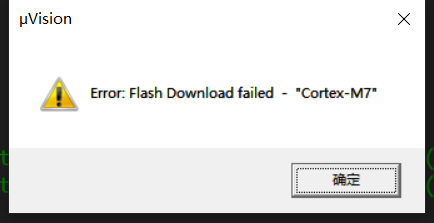

# 1. Flash 
## (1) Error: Flash Download failed - "Cortex-M7"

日志里是连续从 0x08000004 开始大面积 mismatch，这通常不是“某几个字节写坏了”，而是 整段写入根本没按预期生效。常见原因：
1) Flash 写保护/读保护/Bank 映射导致“写入被拒绝或写到别处”
2) 调试器使用了“after startup completion point memory map / init script”

解决思路:
1) 确认“擦除是否真的生效”:erase