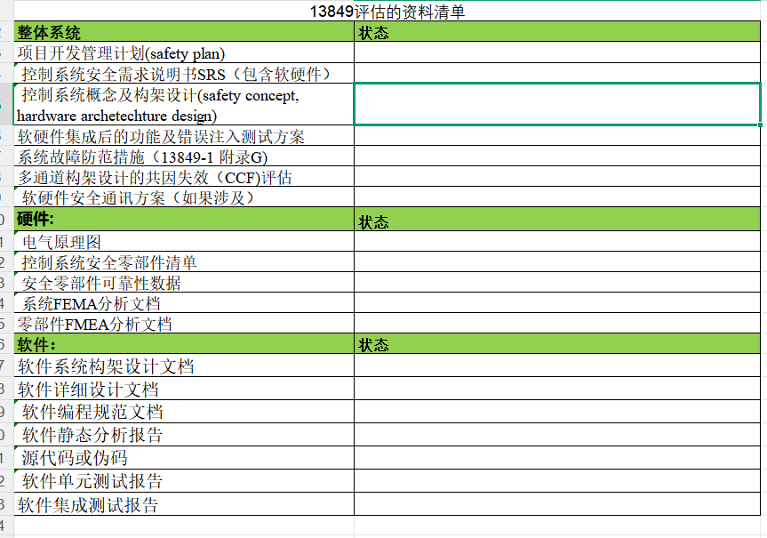
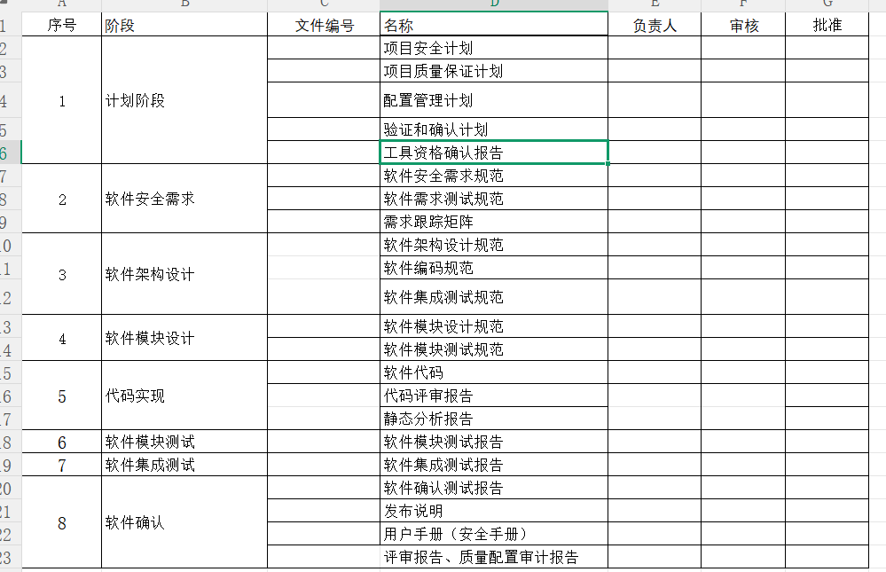

<style>
img{
    width: 60%;
    padding-left: 0%;
}
</style>
```go
git status -sb
Ctrl + S 保存文件
git switch develop
git pull
git add -A
git commit -m "update notes"
git push
```
# 12-26
- 安装matlab
- 继续进行STL的代码编写
- 准备明天的会议
- 
## 12月10-11实现STL信息打印
## 组会 -2025-12-29
- 列出现在的问题 - 工具信任度
- 我们这样先冻结版本的方式是否可以
- 确定通信的内容和实现的方式
- 安全等级问题 - 等级4是否可以合并
- 升级部分
	- A B区问题，B取通过CRC校验完后是否要跑一圈确定成功后再进行app的刷写，确定升级后固件的功能正常
		- 喂狗正常，跑一圈代码
	- 升级的模式  - 是维修模式吗
	- 升级不是只能开始的时候，要在程序的任何地方
- 刷新周期，10m 100ms  -  1s是否有必要
- 结果评判，两个MCU不一致如何判断，投票结果如何判断
- 安全状态的reaction补充
- 时序图，修改
- 两个MCU如何区分
	- 代码的区别是否很大，如何区分如在升级的时候如何判断谁是1谁是0
	- LL镜像的具体做法，还有别的代码的使用
	- 两个MCU的CRC是否有区分
- 测试芯片的频率是否真的是550MHz
- 函数中的时钟最好不要用阻塞的方式
- 现在的Cubemx生成的方式，像GPIO，ADC等是否要生成，还是自己手写实现。

- 为啥要选择LL库，细说原因

## 组会 下周的任务2025.12.29-1.5
- 升级功能
- 自检库
 [x] 安装Matlab
 ### 12.29
 - 按照儒雅建议，罗列出会议的提问点，并自己得先了解问题
 - 修改文档的图片，改为时序图，和升级部分要随时可检测
 
 ### 12.30
 - 基本完成修改，文档+提问
 - 修改了sct的文档颜色修改
 - 进行RAM的自检
-------------------------
- 完成了环形shell字符串输出

## 1. 两周会议12.31
### 1.1. 组会思路
**会议主题 - 明确的标准 & 需求**
**给出实现的框架要求 / 目标   -  保证实现的效果 -  软硬件结合**
### 1.2. 记录点
- 西科的安全控制器
- 三段式使能（"hold to run"）:只有持续动作（持续按/持续握）时才允许运动，一旦放开就停
### 2.2. 问题点
#### 2.2.1 刹车系统  
- 用来控制电机的制动器/驱动器的SQ安全软距
- 安全PLc的双路输出,走0类停止，不管是走直接短驱动器的动力电，还是断驱动器STO（安全扭矩关闭）
- 都是两路继电器输出
- 继电器方案的话，输出直接控制两个主接触器，这两个主接触器是串联的，然后串联到给驱动器48V供电的标柱上
#### 2.2.2 速度模式
- 每一个电机有两个编码器
- 如果超速，会进入零类停止或者Ⅰ类停止
- 低于0.3m/s的使用场景-激光对接
#### 2.2.3 急停模式
- 急停的方式：24V输出   急停脉冲方波输出     0类停止
- 对装的时候短暂屏蔽，速度不能超过0.3m/s 
	- 屏蔽信号走 PLd - 走IO
#### 2.2.4 维修模式
- 安全功能屏蔽 -需要等级b -屏蔽雷达


#### 2.2.5 雷达区域切换 GPIO 配置等基本问题
- 雷达区域切换 通过雷达的静态输入IO实现
- IO的配置14对 ：软件配置，可以进行10对 + 8个
- 离线配置 参数 -这里还不确定是json刷还是什么方法

#### 2.2.6 OSSD信号输入（要达到PLD等级，要求有这个）
- 雷达安全接近开关/光电开关 触发了后会输入 OSSD信号（一些安全传感器出来的也可能是）
	- 信号是反向的，也有相位差
- 诊断出各种工况：对电源短路、对地短路还是交叉短路
- 脉冲宽度300微秒
- 不同厂家波形是否一致，搜出来的结果不一致

- 三段式使能开关 “hold to run" 手操机 PLc  
- 485 MCU1升级bootloader，mcu单独升级
- 外部技术支持点：
	- 两天的功能安全培训
	- 电路设计指导
	- 软件架构执行
	- 软件测试服务
	- 风险评估及安全工具识别


## 26-1-6
### (1) 目标
- 整好STL移植
- 改好文档

### (2) 完成任务
- 看一下IEC-61784-3-2016文档

## 26-1-8
- 完成CPU的移植

## 26-1-13
- 看懂CPU自检的故障注入
## 26-1-23
基本程序项目
isr故障注入
回家看若慧的文档

# 1-29 指导专家的第一次指导
## 1. 和杭哥的交流
1） 确定目标（要实现的功能）  
2） 确定参数的安全范围参数（给个指标超过多少 延迟）

## 2. 设计的思路
- 安全控制器的目标：类似PLC的电子模块，这个模块是用于机器人里的，模块的来源是机器人上的指标
- 专家：把PLC当成一个黑盒，围绕这个把外围的东西说清楚； 然后再具体的架构上的描述 （然后再逐步拆解黑盒说明内部做了哪些工作 - 我们后边要做的事情）
- 要点：前期需要有一个场景描述，从更高的Level去做描述
## 3. 专家谈话
### (1) 基本抽象
1） 存在两种的材料13849 和61508 我们当前使用的是13849  按着一份资料进行就可 各个版本的框架基本一致


image.png
2） 需要功能总监 协调研发资源 / 理解每个文档的目的，再拆分到各章节应该包含的内容（遵循自上而下的逻辑）
3） 目前的建议都是不涉及技术层面 只是针对文档编写方式 - 应突出的内容、放置的章节以及要补充的部分
4） 应用层面需求从场景出发，将功能描述清楚（为何这样做/审核机构面对的具体场景）
5）CRA网络弹性法案：整车的分析如果可能收到攻击，就要有这个， 然后才进行内部模块的分析控制器的分析
### (2) 软件相关
1）服务范围
- 业务范围：包含法规和标准的合规、咨询以及工程服务；
- 测试方面：围绕信息安全 、网络安全提供测试服务
- 软件方面：以代理形式合作：包括静态代码扫描、规则类工具SCA软件成分分析
- 看组织角色有无确实 》》 **合理的流程才能做出好的产品**（项目经理，质量工程师，配置工程师，软硬件工程师）
- 静态分析的工具包含在服务内部
- SCA ：代码质检员：提前抓Bug、卡MISRA-C等的编码规范、提高安全可靠性、减少返工、形成证据链（每次扫描结果可追溯）
2） 海康举例
- 1个责任表格，1个技术措施选择

3）写代码要按照MISRA的标准来写，之后做静态扫描 给出报告 **（重要的是给出报告）**(13849的09文档代码分析报告)
- Reference:(1) xx使用指南.doc (2) xx编码规范.doc{前两个是我们内部规定的} (3) MISRA C 2012 Guidelines for the use of the ...

4）问题回答
- 版本冻结：再软件安全计划内有软件配置管理 》》提前有个计划 《==》测试最终报告 两者要能够匹配起来
- 编译器的要求：要符合61508的标准编译器，我们使用的ARM是都通过了61508的
- 不关注你中间的程序函数，关键的是你的功能级别来说明符合工程安全设计
- 软件的差异化：这些要根据最终算出来的分数能不能达到安全等级来考虑
- 安全分级：根据实际场景去划分安全等级
- （硬）冗余的一个坏了：场景安全 但是功能没完成  》》 我的理解是要满足SIL3的安全等级的同时还要考虑PLe的性能等级
- （拓）升级功能：需要考虑降级，防止别人通过降级的漏洞 反降级（OGP）

